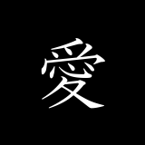
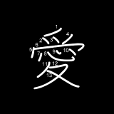
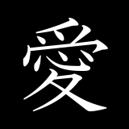
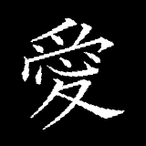
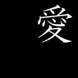
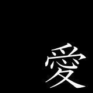
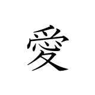

# Create kanji characters datasets

## Introduction

I want to create a CNN that recognizes ~2000 [Jouyou kaji](https://en.wikipedia.org/wiki/J%C5%8Dy%C5%8D_kanji) in order to make my Japanese study journey more interesting than just *cramming* [Anki](https://github.com/dae/anki) decks.

I made[ an application](https://github.com/kuroemon2509/handwriting_canvas) that allows user to draw anything and save as image so that I can use it as *training* data. However, it was a mundane task so here we are

***Creating datasets from `fonts` and some `math`.***

## Samples

- Multiple `fonts`

- Mutilple `font_size`

- Rotation

- Translation

- Invert color

