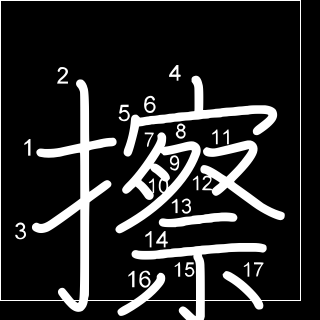

# Create kanji characters datasets with Javascript Canvas (nodeJS) or PIL (Python)

- Javascript Canvas:

    - Pros:

        - Can easily center image without much effort

    - Cons:

        - Can only save as 4 or 3 channels image (larger size)
        - Asynchronous calls put too much stress on the system (it will freeze the computer if you can't shut it down)

- Python PIL

    - Pros:

        - Have for image processing operations
        - Can save image as grayscale image (single channel)

    - Cons

        - Python linear natural makes the process takes very long time to complete.
        
## Instructions (Python)

0. Collect fonts (`n` fonts)

0. Choose `font_size` (`x4` images)

    - `font_size` range from `60%` to `90%` of the image's side length (`10%` each step) as we will use square image

0. Make a canvas 2 times larger than the intend image size because some characters will not fit nicely inside its `font_size` box. We will crop it later.

    - Example:

    

0. Rotate the characters (`x5` images)

    - `rotate` range from `-10` degree to `10` degree (`5` degree each step)

    **Note**: Remember to set center of rotation.

0. After rotation we will get the actual width and height of the character by finding all non-background pixels. Then we will get the `maximum` and `minimum` indies of `x` and `y` axes.

0. Perform accurate cropping the kanji character based on the actual `width` and `height` of the character and the image `size`

0. Invert image color (`x2` images)

0. Translate the characters (minimum `x?` images) *(Optional)*

    - `translate_x`: LEFT, CENTER, RIGHT
    - `translate_y`: TOP, CENTER, BOTTOM

    - For each image we will get its bounding box (to prevent overshooting out of the image) and translate the image by `(x, y)` with `i = (10%, 0)` and `j = (0, 10%)` as unit vectors

    - We can continuosly increase the `i` and `j` values by `10%` of the image size (width and height respectively) until the kanji bounding box hit the border.

    - As you can can see with the sample above whose image size `(320, 320)` and `font_size` `300` (> 90%), translation may not mean much but not with smaller `font_size` like `60%` image size. Below is a sample of translation with small `font_size` with each channel is a grayscale image.

    

## Note

- We can also change the color of `background_color` and `font_color`.